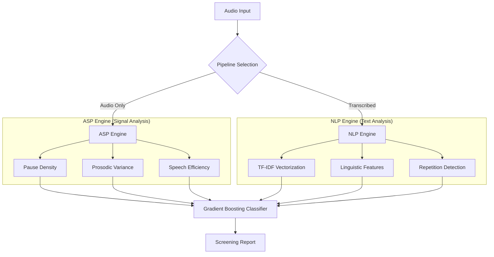

#  DementiaSense AI: Speech-Based Cognitive Screening

[](https://github.com/)
[](LICENSE)
[](https://openai.com/research/whisper)

**DementiaSense AI** is a multi-modal screening system designed to detect early indicators of cognitive impairment (MCI and Dementia) through non-invasive speech analysis. By combining advanced Audio Signal Processing (ASP) with Natural Language Processing (NLP), the system identifies subtle linguistic and prosodic markers often missed in conventional clinical observations.

---

##  Research & Biological Foundations

Dementia often manifests in speech long before physical symptoms appear. Our research focuses on two primary domains of biomarkers:

### 1. Linguistic Markers (The "What" of Speech)
As cognitive decline progresses, individuals often experience *Anomic Aphasia* (difficulty finding words). This leads to:
- **Lexical Poverty**: Use of simpler words and high pronouns-to-nouns ratios.
- **Syntactic Complexity**: Reduction in sentence length and complexity.
- **Redundancy**: Frequent repetition of phrases or ideas (Perseveration).
- **Incoherent Transitions**: Abrupt shifts in topic or loss of logical flow.

### 2. Paralinguistic/Acoustic Markers (The "How" of Speech)
Neurological degeneration affecting motor control and memory retrieval manifests in:
- **Speech Disfluency**: Increased frequency of "filled pauses" (um, uh, ah).
- **Prosodic Irregularity**: Abnormal variation in pitch (F0) and speech rate (WPM).
- **Silent Pauses**: Longer and more frequent gaps durigit remote add origin https://github.com/ARYANCY/Speech-Based-Cognitive-Screening.git
git branch -M main
git push -u origin mainng word retrieval (Word-Finding Hesitations).
- **Voice Quality**: Changes in jitter, shimmer, and Harmonic-to-Noise Ratio (HNR).

---

##  System Architecture

DementiaSense AI employs a hybrid pipeline to maximize detection accuracy:



---

##  Technical Feature Set

The system extracts over **790 independent features** across multiple dimensions:

| Category | Key Metrics | Importance |
| :--- | :--- | :--- |
| **Fluency** | Words Per Minute (WPM), Pause Count, Hesitation Density | High |
| **Lexical** | Type-Token Ratio (TTR), Pronoun Density, Stopword Ratio | Medium |
| **Acoustic** | Zero-Crossing Rate (ZCR), RMS Energy, Spectral Centroid | Medium |
| **Discourse** | Repetition Ratio, Filler Word frequency (uh/um) | High |

---

##  Getting Started

### Prerequisites
- **Node.js 16+** (Backend & Frontend)
- **Python 3.8+** (ML Inference Engine)
- **FFmpeg** (Mandatory for Signal Processing)

### Quick Installation
```bash
# Clone the repository
git clone https://github.com/YourUser/DementiaSense-AI.git
cd DementiaSense-AI

# Setup Backend
cd backend
npm install
pip install -r requirements.txt

# Setup Frontend
cd ../frontend
npm install
```

### Environment Setup
Copy `.env.example` to `.env` in both folders and configure your ports and MongoDB URI.

---

##  Prediction Logic & Calibration

The system doesn't just output a "Yes/No". It provides a **calibrated probability score** based on:
1. **Base ML Probability**: Derived from the Gradient Boosting model.
2. **Disfluency Multipliers**: Recursive boosts based on detected "silent gaps" (>1.5s) and "filler candidates."
3. **Thresholding**: 
   - `< 40%`: Healthy
   - `40% - 60%`: Mild Cognitive Impairment (MCI)
   - `60% - 85%`: Moderate Risk
   - `> 85%`: High Risk / Severe Detection

---

##  Medical Disclaimer
**DementiaSense AI is a screening tool, NOT a diagnostic medical device.** It is intended for early-stage screening and research purposes only. All results should be validated by a qualified neurologist or healthcare professional.

---

##  Roadmap
- [ ] Integration of Vision-based Emotion Analysis (Facial blunting detection).
- [ ] Support for non-English languages (Spanish, Hindi, Mandarin).
- [ ] Mobile-native application for continuous monitoring.
- [ ] Federated Learning support for patient privacy.

---

**Developed for the advancement of early dementia detection through technology.**
