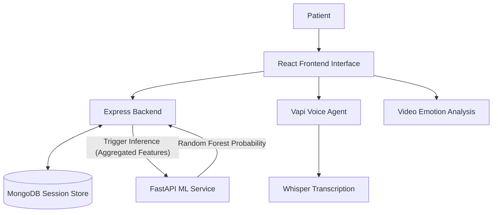

# Dementia Detection Multimodal System

**A Full-Stack System utilizing voice, cognitive games, and facial emotion analysis to screen for dementia risk in a clinical setting.**

## Overview

The Clinical Cognition Screener is designed to offer a multi-modal, session-based workflow targeting early indicators of dementia. By aggregating linguistic/acoustic markers, visual reaction parameters, and real-time facial emotion recognition, the system provides an enhanced predictive indicator compared to single-modality checks.

## Architecture Highlights

- **Frontend:** React, TailwindCSS, Vite (Simple, linear session progress bar).
- **Backend:** Node.js, Express, MongoDB (Session persistence and state handling).
- **Machine Learning:** FastAPI, Python, scikit-learn, Vapi (Voice), Whisper, DeepFace (Real-time tracking).

## Documentation Paths

Comprehensive documentation is separated into modular sections within the `docs/` directory:

- [Setup Guide](docs/setup_guide.md): Step-by-step installation instructions for development and production.
- [System Architecture](docs/architecture.md): Deep-dive into data pipelines, session rules, and DB schemas.
- [Future Improvements & Roadmap](docs/improvements.md): Outlined scope for clinical scaling, model optimization, and deployment.

## Running Locally

Refer to the [Setup Guide](docs/setup_guide.md) for detailed commands. As a quick start:
1. Copy `.env.example` to `.env` and fill variables.
2. Run backend: `npm install && npm start`
3. Run ML Inference: `pip install -r requirements.txt && python inference.py`
4. Run Frontend: `npm install && npm run dev`
